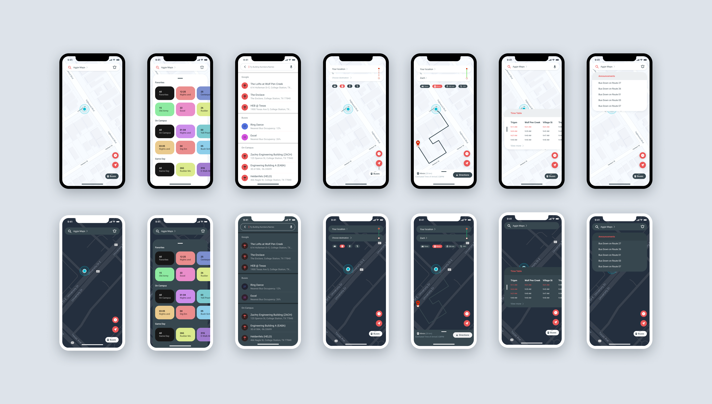

## Introduction

Howdy!

For our Computer Science Capstone project we decided to spend the semester replacing the Texas A&M App by adding better bus route integration, Aggie Map information, and route planning all in your pocket. No matter how you've stumbled across this repository, we hope this app may make your day a little brighter on campus.

-Sean, Taha, Mahir, and Rory
Class of ‘22

## Abstract of Project

There is a current problem on some University campuses around the world, and that problem has to do with reliability of real-time information(RTI) of mapping systems for students/faculty on campus. Texas A&M is a prime example of a University that spent many hours mapping out every area of the school and putting it together into a web application. That web application is great in many ways, but its usefulness ends when someone is trying to navigate campus while on campus. "Aggie Map" as it is called, isn't optimized well for mobile devices and many of the features that you can access on your laptop, you are unable to access on your phone [2]. The Texas A\&M Application for mobile devices makes this even worse by offering "Aggie Map" as a WebView window within the application which makes functionality limited, and makes the application run even slower. Students and faculty on campus want a way to access the information that they need in a pinch from their smartphone. Let's say that someone needs to find directions from one class to another using available bus routes. This functionality exists, but is mostly non-existent on mobile devices and I know for a fact that no one is walking around campus with their laptop out to get directions from one building to another. This is especially useful to gain access to real-time information on where the current buses are. One study we researched has concluded that "real-time information users say that their average wait time is 7.5 min versus 9.9 min for those using traditional arrival information, a difference of about 30%" [1]! Our proposed solution is to create a native mobile application that brings all of the great features of "Aggie Map" and some more mobile-centric features right into the pocket of your average Aggie. With this new application, users will have the ability to interact with a native mapping SDK on their device and gain access to real-time bus information with routes and current locations of the buses, as well as route planning from one location to another whether that be on or off campus. This would solve the problem of a lacking mobile experience as well as provide a better way for everyone to navigate both on campus and around the local Bryan/College Station area. Since the Texas A\&M application already exists on mobile devices, conducting a quantitative study using Likert scales is the first primary way we plan on evaluating our product. We will then conduct statistical analysis in order to find out how well people rate the prior solution and our solution. Along with this, we will have other metrics such as how fast our application displays data compared to prior solutions and the number of features met compared to other solutions.This solution is one that will hopefully create a push for similar applications to be developed in the future for other localities, universities, and schools. A happier bus-rider could also contribute to more people taking the bus and therefore causing less emissions. We are keeping in mind all of these contributions as we continue with our proposal and design.

## Mockups

## Teaser Screenshots

## References

[1] Kari Edison Watkins, Brian Ferris, Alan Borning, G Scott Rutherford, and David Layton. 2011.  Where Is My Bus? Impact of mobile real-timeinformation on the perceived and actual wait time of transit riders.Transportation Research Part A: Policy and Practice45, 8 (2011), 839–848.

[2] \[n.d.\]. Aggie Maps Texas A&M University. https://aggiemap.tamu.edu/map/d.
